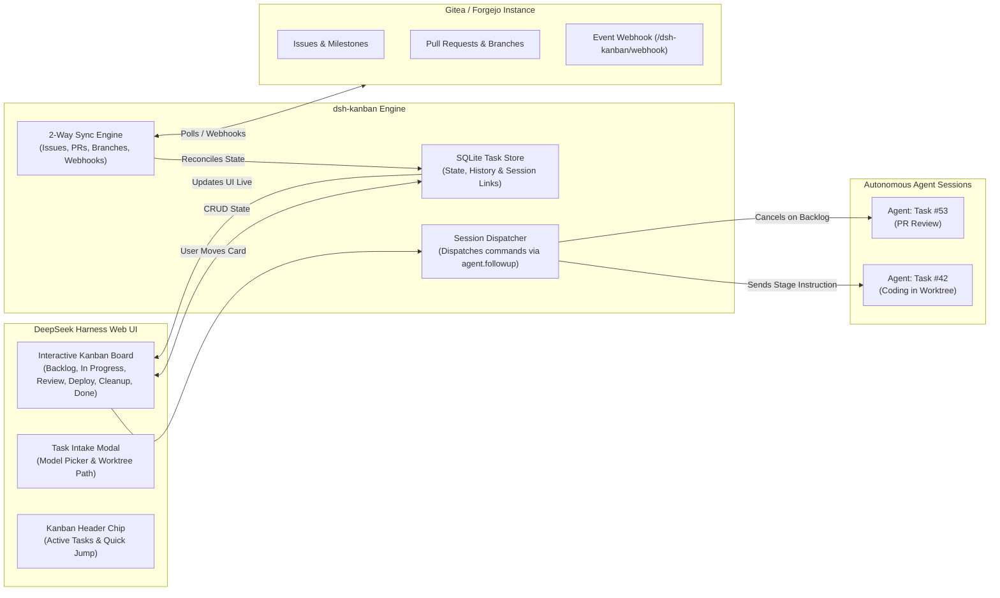

# 📦 @goodandready/dsh-kanban

<div align="center">

<h3>Visual Kanban Board & Task Agent Session Dispatcher for DeepSeek Harness</h3>

<p align="center">
  <a href="https://www.npmjs.com/package/@goodandready/dsh-kanban"></a>
  <a href="LICENSE"></a>
  <a href="https://github.com/topics/dsh-plugin"></a>
  <a href="https://nodejs.org"></a>
</p>

<p align="center">
  <a href="https://goodandready.app/"></a>
</p>

<p align="center">
  <a href="README.md"><b>🇬🇧 English</b></a> •
  <a href="README.ru.md"><b>🇷🇺 Русский</b></a> •
  <a href="README.zh.md"><b>🇨🇳 中文说明</b></a>
</p>

</div>

---

## ⚡ Overview & Problem Solved

Managing concurrent software tasks across multiple autonomous AI agents easily leads to context drift, lost pull request handoffs, and untracked branch lifecycles. Without a dedicated visual board, users must manually juggle disparate chat windows and verify issue states on remote VCS trackers.

**`@goodandready/dsh-kanban`** introduces an interactive **Kanban Board** embedded natively into DeepSeek Harness. Every card represents a concrete development task linked to its own **dedicated agent session**. Moving a card between workflow columns automatically dispatches lifecycle instructions directly to the agent (e.g. implementing, opening PRs, deploying, or cleaning up worktrees), with continuous **2-way Gitea/Forgejo synchronization**.

---

## 🏗️ Architecture



---

## ✨ Full Feature Breakdown

### 1. Interactive Visual Kanban Board in Web UI

* **Workflow Columns**:
  * **Project Board Mode**: `Backlog` ➔ `In Progress` ➔ `Review` ➔ `Deploy` ➔ `Cleanup` ➔ `Done`.
  * **Simple Board Mode**: `Backlog` ➔ `In Progress` ➔ `Review` ➔ `Done`.
* **Drag-and-Drop Lifecycle Transitions**: Moving a card immediately executes the underlying stage trigger.
* **Top Navigation Chip**: Live summary in the chat header showing active in-progress tasks with 1-click jump to board or active session.
* **Rich Task Cards**: Shows task title, issue index (`#42`), assigned LLM model, target worktree, branch name, PR review status, and uncommitted diff markers.

---

### 2. Task-to-Agent Session Dispatcher

Unlike passive task boards, `dsh-kanban` actively drives the agents:

| Column Moved To | Action Taken by Dispatcher | Instruction Sent to Agent Session |
|:---|:---|:---|
| **`Backlog`** | 🛑 **Stops Active Turn** | `agent.cancel({ kind: 'user' })` — stops agent execution immediately |
| **`In Progress`** | ⚡ **Dispatches Turn** | *"Start or continue implementing this task according to standard workflow."* |
| **`Review`** | 🔍 **Dispatches Turn** | *"Prepare work for review: mark PR ready and request human code inspection."* |
| **`Deploy`** | 🚀 **Dispatches Turn** | *"Merge pull request and deploy. Moving card to Deploy is explicit user approval."* |
| **`Cleanup`** | 🧹 **Dispatches Turn** | *"Clean up: delete remote/local branches, prune worktrees, log summary to issue."* |
| **`Done`** | 🔒 **Human / VCS Only** | Closed automatically upon issue closure or user confirmation |

---

### 3. Continuous 2-Way Gitea / Forgejo Sync

* **Bi-directional Reconciliation**: Polling and Webhook receiver (`/dsh-kanban/webhook`) sync issue descriptions, comments, PR status, labels, and closed states.
* **Conflict Resolution**: Timestamp-based merge logic ensures manual edits in Gitea and board moves resolve cleanly without state clobbering.
* **Automatic Issue Linking**: New tasks created on the board can automatically spawn corresponding issues and branch worktrees on Gitea.

---

### 4. Agent Tools & Human Governance Safety

| Tool Name | Scope | Purpose | Safety Rules |
|:---|:---|:---|:---|
| `board_move` | Board | Lets agent report progress and transition card to next stage | ⚠️ Cannot transition to `done` (closed by fact/human only) |
| `board_plan` | Board | Saves structured step-by-step implementation plan to task card | - |

---

## 📦 Installation

Install via DeepSeek Harness CLI:

```bash
dsh plugin --profile web add @goodandready/dsh-kanban
```

Restart DSH Web UI and perform a hard-refresh (`Ctrl+F5` or `Cmd+Shift+R`).

---

## ⚙️ Configuration

Navigate to **Settings -> Plugins -> Kanban**:

```yaml
# config.yaml
dsh-kanban:
  boardKind: "project"
  giteaUrl: "https://gitea.yourcompany.com"
  giteaTokenEnv: "GITEA_TOKEN"
  giteaOwner: "my-team"
  giteaRepo: "main-app"
  syncIntervalMs: 30000
  webhookSecret: ""
```

### Settings Reference Table

| Key | Type | Default | Description |
|:---|:---|:---|:---|
| `boardKind` | `string` | `"project"` | Board workflow mode: `"project"` (6 columns) or `"simple"` (4 columns) |
| `giteaUrl` | `string` | `""` | Base URL of Gitea/Forgejo instance for task synchronization |
| `giteaTokenEnv` | `string` | `"GITEA_TOKEN"` | DSH Credential name containing the Gitea API access token |
| `giteaOwner` | `string` | `""` | Default organization or username for synced repositories |
| `giteaRepo` | `string` | `""` | Default repository name for issue/task sync |
| `syncIntervalMs` | `number` | `30000` | Background synchronization polling interval in milliseconds |
| `webhookSecret` | `string` | `""` | Optional secret for validating incoming Gitea webhook signatures |

---

## 🧪 Testing & Verification

Run the comprehensive 520+ unit and integration test suite:

```bash
npm test
```

---

## 📄 License

MIT © [GooDAnDReaDY](https://github.com/GooDAnDReaDY)
