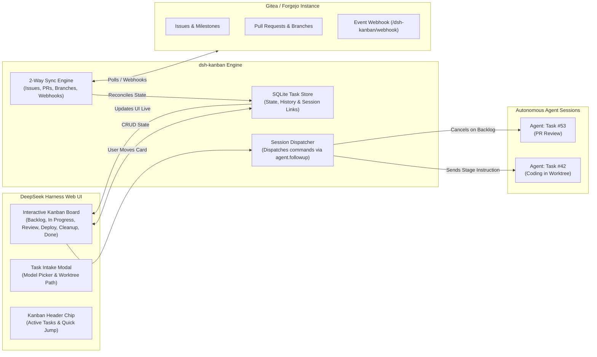

# 📦 @goodandready/dsh-kanban

<div align="center">

<h3>Visual Kanban Board & Task Agent Session Dispatcher for DeepSeek Harness</h3>

<p align="center">
  <a href="https://www.npmjs.com/package/@goodandready/dsh-kanban"></a>
  <a href="LICENSE"></a>
  <a href="https://github.com/topics/dsh-plugin"></a>
  <a href="https://nodejs.org"></a>
</p>

<p align="center">
  <a href="https://goodandready.app/"></a>
</p>

<p align="center">
  <a href="README.md"><b>🇬🇧 English</b></a> •
  <a href="README.ru.md"><b>🇷🇺 Русский</b></a> •
  <a href="README.zh.md"><b>🇨🇳 中文说明</b></a>
</p>

</div>

---

## ⚡ Overview & Problem Solved

Managing concurrent software tasks across multiple autonomous AI agents easily leads to context drift, lost pull request handoffs, and untracked branch lifecycles. Without a dedicated visual board, users must manually juggle disparate chat windows and verify issue states on remote VCS trackers.

**`@goodandready/dsh-kanban`** introduces an interactive **Kanban Board** embedded natively into DeepSeek Harness. Every card represents a concrete development task linked to its own **dedicated agent session**. Moving a card between workflow columns automatically dispatches lifecycle instructions directly to the agent (e.g. implementing, opening PRs, deploying, or cleaning up worktrees), with continuous **2-way Gitea/Forgejo synchronization**.

---

## 🏗️ Architecture



---

## ✨ Full Feature Breakdown

### 1. Interactive Visual Kanban Board in Web UI

* **Workflow Columns**:
  * **Project Board Mode**: `Backlog` ➔ `In Progress` ➔ `Review` ➔ `Deploy` ➔ `Cleanup` ➔ `Done`.
  * **Simple Board Mode**: `Backlog` ➔ `In Progress` ➔ `Review` ➔ `Done`.
* **Drag-and-Drop Lifecycle Transitions**: Moving a card immediately executes the underlying stage trigger.
* **Top Navigation Chip**: Live summary in the chat header showing active in-progress tasks with 1-click jump to board or active session.
* **Rich Task Cards**: Shows task title, issue index (`#42`), assigned LLM model, target worktree, branch name, PR review status, and uncommitted diff markers.

---

### 2. Task-to-Agent Session Dispatcher

Unlike passive task boards, `dsh-kanban` actively drives the agents:

| Column Moved To | Action Taken by Dispatcher | Instruction Sent to Agent Session |
|:---|:---|:---|
| **`Backlog`** | 🛑 **Stops Active Turn** | `agent.cancel({ kind: 'user' })` — stops agent execution immediately |
| **`In Progress`** | ⚡ **Dispatches Turn** | *"Start or continue implementing this task according to standard workflow."* |
| **`Review`** | 🔍 **Dispatches Turn** | *"Prepare work for review: mark PR ready and request human code inspection."* |
| **`Deploy`** | 🚀 **Dispatches Turn** | *"Merge pull request and deploy. Moving card to Deploy is explicit user approval."* |
| **`Cleanup`** | 🧹 **Dispatches Turn** | *"Clean up: delete remote/local branches, prune worktrees, log summary to issue."* |
| **`Done`** | 🔒 **Human / VCS Only** | Closed automatically upon issue closure or user confirmation |

---

### 3. Continuous 2-Way Gitea / Forgejo Sync

* **Bi-directional Reconciliation**: Polling and Webhook receiver (`/dsh-kanban/webhook`) sync issue descriptions, comments, PR status, labels, and closed states.
* **Conflict Resolution**: Timestamp-based merge logic ensures manual edits in Gitea and board moves resolve cleanly without state clobbering.
* **Automatic Issue Linking**: New tasks created on the board can automatically spawn corresponding issues and branch worktrees on Gitea.

---

### 4. Agent Tools & Human Governance Safety

| Tool Name | Scope | Purpose | Safety Rules |
|:---|:---|:---|:---|
| `board_move` | Board | Lets agent report progress and transition card to next stage | ⚠️ Cannot transition to `done` (closed by fact/human only) |
| `board_plan` | Board | Saves structured step-by-step implementation plan to task card | - |

---

### 5. Card Detail: Labels, Priority and Deadlines

Cards carry more than a title. Labels and priority are editable right in the card
window — for a Gitea-backed task they travel back to the issue, for a board-only
task they live locally. Priority drives an "urgent first" ordering, so the column
answers "what now" without reading every card.

A due date can be set on any card. Overdue cards are highlighted, and a switch in
the board header narrows the board to them alone — the answer to "what is already
late" is one click, not a scan.

### 6. Ownership: Who Took the Task

The board carries two different people per task and never confuses them: the
**author** who filed the issue and the **assignee** who took it. Both arrive
from Gitea, both are filter dimensions, and the assignee is shown on the card
itself — "who is doing this" is asked more often than "who wrote it".

A single button in the task window takes the task or drops it. Taking assigns
the account whose token the board uses: the harness has no user of its own, so
"me" is resolved by asking Gitea rather than by guessing. The change travels
back to the issue through the outbound queue, so the board keeps working while
Gitea is down; dropping sends an empty assignee list, because Gitea reads a
missing field as "leave it alone".

Three shortcuts follow from ownership. The column groups **by assignee** as
well as by project, with "nobody took it" always first — that group is what the
layout is opened for. A **"Mine: N"** button in the header narrows the board to
your own tasks in one click; it is drawn only when Gitea told the board who you
are and you actually have tasks, because a lying counter is worse than none.
And **starting work takes the task**: a free task becomes yours on launch, alone
or as part of a batch, while a task already assigned to someone else is left
alone.

Assignment made in Gitea arrives on the next sync — in both directions,
including removal. Filtering by "nobody" answers the question the board is
opened for most often: what is free to pick up.

### 7. Board Snapshot: Export and Import

`GET /dsh-kanban/snapshot` returns the whole board as JSON; `POST` to the same
route restores it. Import is idempotent: a task whose id is already on the board
is skipped rather than duplicated, so re-running an import is safe.

The snapshot is one resource with two verbs on purpose. An earlier build gave the
upload the path `/dsh-kanban/import`, which the Gitea issue import already owned —
two handlers on one path mean one of them silently never answers.

## 📦 Installation

Install via DeepSeek Harness CLI:

```bash
dsh plugin --profile web add @goodandready/dsh-kanban
```

Restart DSH Web UI and perform a hard-refresh (`Ctrl+F5` or `Cmd+Shift+R`).

---

## ⚙️ Configuration

Navigate to **Settings -> Plugins -> Kanban**:

```yaml
# config.yaml
dsh-kanban:
  boardKind: "project"
  giteaUrl: "https://gitea.yourcompany.com"
  giteaTokenEnv: "GITEA_TOKEN"
  giteaOwner: "my-team"
  giteaRepo: "main-app"
  syncIntervalMs: 30000
  webhookSecret: ""
```

### Settings Reference Table

| Key | Type | Default | Description |
|:---|:---|:---|:---|
| `boardKind` | `string` | `"project"` | Board workflow mode: `"project"` (6 columns) or `"simple"` (4 columns) |
| `giteaUrl` | `string` | `""` | Base URL of Gitea/Forgejo instance for task synchronization |
| `giteaTokenEnv` | `string` | `"GITEA_TOKEN"` | DSH Credential name containing the Gitea API access token |
| `giteaOwner` | `string` | `""` | Default organization or username for synced repositories |
| `giteaRepo` | `string` | `""` | Default repository name for issue/task sync |
| `syncIntervalMs` | `number` | `30000` | Background synchronization polling interval in milliseconds |
| `webhookSecret` | `string` | `""` | Optional secret for validating incoming Gitea webhook signatures |

---

## 🧪 Testing & Verification

Run the comprehensive 520+ unit and integration test suite:

```bash
npm test
```

---

### 8. Metrics: Where the Work Stands

The transition log has been filling up since day one, but it could only be read
one task at a time. The **Metrics** screen adds it up: how long tasks sit in each
column (median first — one task forgotten for half a year drags the average
until it describes nothing), how many reached Done in the last week and month,
and which tasks have been sitting still longer than the threshold.

Sitting time counts from entering the column, not from creation: a task can be
old and still move every day. Nothing is written — a metric that writes stops
being an observation and becomes another source of truth to disagree with.

### 9. Milestones and Reviving a Dead Session

The milestone travels with the issue and becomes a filter dimension of its own,
so "what is left before 0.2.0" is answered on the board rather than in Gitea.
Removing a milestone is news too, so an emptied field is synced like any other
change. Setting a milestone from the board is deliberately out of scope for now:
reading first, writing later, or we get a second place where it is edited.

A task whose session died — the harness restarted, the agent is gone — shows
"stopped". Its card now offers **resume work**: the old session is tried first,
and only if it cannot be revived does a new one start. The board says which of
the two happened, because "continued" and "started over" differ by whether the
conversation still exists.

## 🔌 Core Compatibility Check

A named import of an export the installed core no longer has is a `SyntaxError`
at parse time: the whole plugin tree fails to load and the harness restarts in a
loop. That happened twice in one week, and both times the owner found out before
the tests did.

```bash
npm run compat            # uses $DSH_HOME, or ~/.dsh/profiles/web
npm run compat -- /path/to/profile
```

The check reads every `import { … } from '@deepseek-ai/…'` in `lib/`, resolves
each package the way the harness resolves it — from the profile directory — and
compares the requested names against the actual exports. It is deliberately not
part of `npm test`: the test suite runs without a core and without a profile.
Run it on the machine where the harness lives, before publishing.

## 💻 Cross-Platform Path Handling

Task working directories (`resolveCwd`) respect operating system path conventions.
On Windows, repository root fencing accounts for drive letters and backslash path
separators, ensuring full test and runtime compatibility across POSIX and Windows.

## 🌳 Git Worktree Isolation

When in-progress work begins on a repository task, the agent session is automatically
isolated into a dedicated git worktree (`$DSH_HOME/worktrees/<repo-key>/<task-id>/` on branch
`task/<id>-<slug>`). The worktree is registered in DSH's `workspaceRegistry` for full UI
visibility and multi-agent concurrency protection. During the `cleanup` phase, uncommitted files
are detected via `git status --porcelain` to prevent data loss, followed by clean worktree and workspace
deregistration.

## ⚙️ Host-Side Automation & Governance (v0.1.26+)

- **Host-Side Cron Scheduler**: Autonomous 5-field cron parsing (`分 时 日 月 周`) executed in the host Node.js process. Tasks trigger reliably in the background without needing an open browser tab.
- **Power Inhibitor (`preventIdleSleep`)**: Cross-platform system idle sleep prevention (PowerShell Win32 `SetThreadExecutionState` on Windows, `/usr/bin/systemd-inhibit` on Linux, `/usr/bin/caffeinate` on macOS) active while tasks or sessions run.
- **PROGRESSDUMP Handover**: Structured progress snapshots (`<<<PROGRESSDUMP ... >>>PROGRESSDUMP`) with secret redaction (`[REDACTED]`) and slash-command suppression, formatting clean task handover preambles for subsequent agents.
- **Permission Confirmation Gate**: Tasks requesting permissions exceeding the configured baseline (`sessionDefaultPermission`) enter a gated state requiring explicit human confirmation before launch. Modifying parameters resets the gate.
- **Task Execution History (`runs`)**: Last 20 execution attempts per task stored directly inside SQLite `tasks.runs`, tracking duration, outcome (`succeeded`, `failed`, `cancelled`), model, and direct links to session chats.

## 📄 License

MIT © [GooDAnDReaDY](https://github.com/GooDAnDReaDY)
