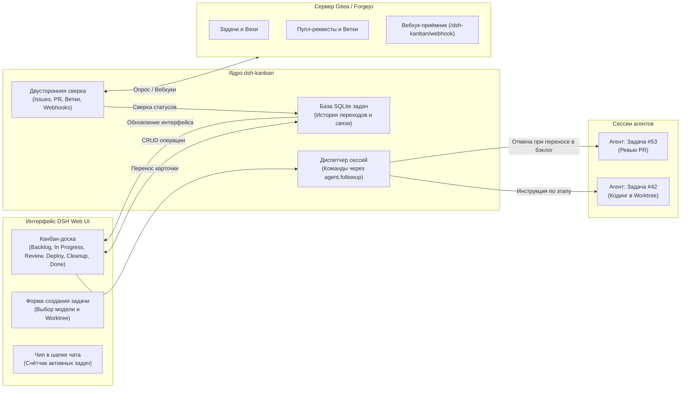

# 📦 @goodandready/dsh-kanban

<div align="center">

<h3>Интерактивная Канбан-доска и диспетчер сессий агентов для DeepSeek Harness</h3>

<p align="center">
  <a href="https://www.npmjs.com/package/@goodandready/dsh-kanban"></a>
  <a href="LICENSE"></a>
  <a href="https://github.com/topics/dsh-plugin"></a>
  <a href="https://nodejs.org"></a>
</p>

<p align="center">
  <a href="https://goodandready.app/"></a>
</p>

<p align="center">
  <a href="README.md"><b>🇬🇧 English</b></a> •
  <a href="README.ru.md"><b>🇷🇺 Русский</b></a> •
  <a href="README.zh.md"><b>🇨🇳 中文说明</b></a>
</p>

</div>

---

## ⚡ Обзор и решаемая проблема

При ведении параллельной разработки силами нескольких автономных AI-агентов легко потерять контроль над статусом задач, проверкой пулл-реквестов (PR) и ветками в репозитории. Без наглядной доски разработчику приходится переключаться между десятками вкладок чата и вручную сверять тикеты в трекере.

**`@goodandready/dsh-kanban`** встраивает полноценную **Канбан-доску** прямо в Web UI DeepSeek Harness. Каждая карточка на доске связана со своей **выделенной сессией агента**. Перемещение карточки между колонками автоматически отправляет агенту целевую инструкцию (разработка, передача на ревью, деплой или очистка воркдеревьев), поддерживая непрерывную **двустороннюю синхронизацию с Gitea / Forgejo**.

---

## 🏗️ Архитектура



---

## ✨ Исчерпывающий разбор возможностей

### 1. Интерактивная Канбан-доска в Web UI

* **Режимы колонок**:
  * **Режим Project (6 колонок)**: `Backlog` ➔ `In Progress` ➔ `Review` ➔ `Deploy` ➔ `Cleanup` ➔ `Done`.
  * **Режим Simple (4 колонки)**: `Backlog` ➔ `In Progress` ➔ `Review` ➔ `Done`.
* **Drag-and-Drop управление этапами**: простое перетаскивание карточки мгновенно запускает соответствующий рабочий шаг.
* **Чип в шапке чата**: живой индикатор текущих задач с переходом на доску или сразу в чат задачи в 1 клик.
* **Информативные карточки**: отображение номера тикета (`#42`), выбранной LLM-модели, ветки Git, статуса PR и незакоммиченных правок.

---

### 2. Диспетчер команд и сессий агентов

Доска не просто отображает задачи, а напрямую управляет исполнением агентов:

| Колонка назначения | Действие диспетчера | Инструкция в чат задачи |
|:---|:---|:---|
| **`Backlog`** | 🛑 **Остановка хода** | `agent.cancel({ kind: 'user' })` — прерывает работу агента без потери контекста |
| **`In Progress`** | ⚡ **Запуск разработки** | *«Начни или продолжи реализацию этой задачи по стандартному воркфлоу.»* |
| **`Review`** | 🔍 **Запрос проверки** | *«Доведи работу до ревью: сними с PR пометку черновика и запроси проверку.»* |
| **`Deploy`** | 🚀 **Деплой и слияние** | *«Влей pull request и выкати. Перенос в Deploy — это явное согласие на выкатку.»* |
| **`Cleanup`** | 🧹 **Очистка окружения** | *«Прибери за задачей: удали ветку в Gitea, worktree и локальную ветку, запиши итог.»* |
| **`Done`** | 🔒 **Только человек / факт** | Автоматически закрывается по факту закрытия issue в Gitea |

---

### 3. Непрерывная 2-сторонняя синхронизация с Gitea / Forgejo

* **Двусторонняя сверка**: фоновый опрос и вебхуки (`/dsh-kanban/webhook`) синхронизируют заголовки, метки, PR и закрытие тикетов.
* **Разрешение конфликтов**: алгоритм с учётом таймстемпов предотвращает перезапись изменений при одновременных правках на сервере и доске.
* **Автосоздание задач**: новая карточка на доске может автоматически создавать задачу и ветку воркдерева в репозитории.

---

### 4. Инструменты агента и безопасность

| Инструмент | Категория | Назначение | Контроль безопасности |
|:---|:---|:---|:---|
| `board_move` | Доска | Перемещение карточки на следующий этап | ⚠️ Перевод в `done` агенту запрещён (закрывается только по факту) |
| `board_plan` | Доска | Сохранение структурированного плана реализации на карточку | - |

---

## 📦 Установка

Установка через консольный клиент DeepSeek Harness:

```bash
dsh plugin --profile web add @goodandready/dsh-kanban
```

Перезапустите Web UI DSH и обновите вкладку в браузере с очисткой кэша (`Ctrl+F5` или `Cmd+Shift+R`).

---

## ⚙️ Конфигурация

Откройте **Настройки -> Плагины -> Kanban**:

```yaml
# config.yaml
dsh-kanban:
  boardKind: "project"
  giteaUrl: "https://gitea.yourcompany.com"
  giteaTokenEnv: "GITEA_TOKEN"
  giteaOwner: "my-team"
  giteaRepo: "main-app"
  syncIntervalMs: 30000
  webhookSecret: ""
```

### Таблица параметров конфигурации

| Параметр | Тип | По умолчанию | Описание |
|:---|:---|:---|:---|
| `boardKind` | `string` | `"project"` | Режим колонок: `"project"` (6 колонок) или `"simple"` (4 колонки) |
| `giteaUrl` | `string` | `""` | URL инстанса Gitea/Forgejo для синхронизации задач |
| `giteaTokenEnv` | `string` | `"GITEA_TOKEN"` | Имя DSH Credential с токеном доступа к Gitea API |
| `giteaOwner` | `string` | `""` | Организация или логин владельца репозитория |
| `giteaRepo` | `string` | `""` | Имя репозитория для связки задач |
| `syncIntervalMs` | `number` | `30000` | Интервал фоновой периодической сверки (мс) |
| `webhookSecret` | `string` | `""` | Секретный ключ для проверки входящих вебхуков от Gitea |

---

## 🧪 Тестирование и верификация

Запуск полного набора из более чем 520 юнит- и интеграционных тестов:

```bash
npm test
```

---

## 📄 Лицензия

MIT © [GooDAnDReaDY](https://github.com/GooDAnDReaDY)
