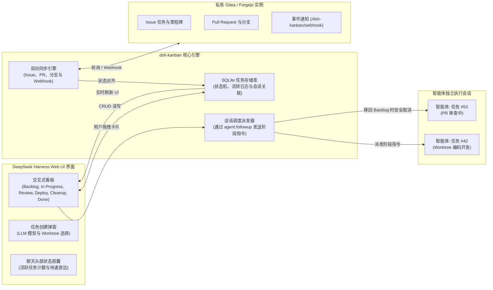

# 📦 @goodandready/dsh-kanban

<div align="center">

<h3>面向 DeepSeek Harness 的可视化看板与任务智能体独立会话调度引擎</h3>

<p align="center">
  <a href="https://www.npmjs.com/package/@goodandready/dsh-kanban"></a>
  <a href="LICENSE"></a>
  <a href="https://github.com/topics/dsh-plugin"></a>
  <a href="https://nodejs.org"></a>
</p>

<p align="center">
  <a href="https://goodandready.app/"></a>
</p>

<p align="center">
  <a href="README.md"><b>🇬🇧 English</b></a> •
  <a href="README.ru.md"><b>🇷🇺 Русский</b></a> •
  <a href="README.zh.md"><b>🇨🇳 中文说明</b></a>
</p>

</div>

---

## ⚡ 核心定位与解决痛点

当多个自主 AI 智能体并行执行复杂研发任务时，极易发生上下文混乱、PR 审查脱节及分支生命周期失控。若缺少统一的可视化看板，开发者只能在数十个聊天窗口与代码托管平台之间来回切换与人工对齐状态。

**`@goodandready/dsh-kanban`** 为 DeepSeek Harness 提供了原生集成的**交互式看板系统**。看板上的每张卡片均绑定**专属独立的智能体执行会话**。卡片在工作流泳道之间的拖拽移动会自动向智能体派发针对性的阶段指令（如开始编码、提交审查、部署上线或清理环境），并全程与 **Gitea / Forgejo 保持毫秒级双向同步**。

---

## 🏗️ 架构设计



---

## ✨ 核心特性深度解析

### 1. Web UI 原生交互式看板

* **两种工作流模式**：
  * **Project 专业模式（6 泳道）**：`Backlog` ➔ `In Progress` ➔ `Review` ➔ `Deploy` ➔ `Cleanup` ➔ `Done`。
  * **Simple 敏捷模式（4 泳道）**：`Backlog` ➔ `In Progress` ➔ `Review` ➔ `Done`。
* **拖拽即触发工作流**：卡片拖入新列立即触发底层智能体的对应阶段任务。
* **顶部导航状态胶囊**：在聊天头部实时展示正在进行的任务数，支持一键呼出看板或跳转专属会话。
* **信息高密度卡片**：展示关联 Issue 编号（`#42`）、所用模型、绑定 Worktree 路径、Git 分支及未提交代码变更。

---

### 2. 任务到智能体专属会话调度器

看板不仅是视觉展示，更是智能体的指令调度中枢：

| 目标泳道 | 调度器触发动作 | 发送给智能体专属会话的指令 |
|:---|:---|:---|
| **`Backlog`** | 🛑 **停止当前轮次** | `agent.cancel({ kind: 'user' })` — 优雅暂停智能体执行，保留上下文 |
| **`In Progress`** | ⚡ **启动开发** | *“按照标准流程开始或继续该任务的编码实现。”* |
| **`Review`** | 🔍 **请求代码审查** | *“将工作推进至审查阶段：解除 PR 草稿状态并请求人工复核。”* |
| **`Deploy`** | 🚀 **合并部署上线** | *“合并 Pull Request 并上线。移入 Deploy 泳道即代表用户明确许可。”* |
| **`Cleanup`** | 🧹 **清理分支环境** | *“清理任务环境：删除远端与本地分支、移除 Worktree，并在 Issue 记录总结。”* |
| **`Done`** | 🔒 **仅人工 / 事实关闭** | 在 Gitea Issue 关闭后自动归档完成 |

---

### 3. 与 Gitea / Forgejo 持续双向同步

* **实时对齐机制**：后台定时轮询与 Webhook 接收器（`/dsh-kanban/webhook`）无缝同步 Issue 标题、标签、PR 状态及关闭事件。
* **时间戳冲突解决**：精准的时间戳仲裁逻辑，杜绝在网页端与代码仓库同时编辑时的状态覆盖问题。
* **一键生成关联任务**：在看板新建任务可自动在 Gitea 创建 Issue 与独立的 Git Worktree 隔离分支。

---

### 4. 智能体专属工具与安全防护

| 工具名称 | 作用域 | 功能描述 | 安全约束 |
|:---|:---|:---|:---|
| `board_move` | 看板 | 允许智能体自主汇报进度并推进卡片至下一阶段 | ⚠️ 严禁移动至 `done`（必须由人工或事实关闭） |
| `board_plan` | 看板 | 将结构化分步实施计划持久化写入任务卡片 | - |

---

## 📦 快速安装

通过 DeepSeek Harness 命令行一键安装：

```bash
dsh plugin --profile web add @goodandready/dsh-kanban
```

重启 DSH Web UI 并强制刷新浏览器页面（`Ctrl+F5` 或 `Cmd+Shift+R`）。

---

## ⚙️ 配置指南

在 Web UI 中打开 **设置 -> 插件 -> Kanban**：

```yaml
# config.yaml
dsh-kanban:
  boardKind: "project"
  giteaUrl: "https://gitea.yourcompany.com"
  giteaTokenEnv: "GITEA_TOKEN"
  giteaOwner: "my-team"
  giteaRepo: "main-app"
  syncIntervalMs: 30000
  webhookSecret: ""
```

### 配置参数速查表

| 配置项 | 数据类型 | 默认值 | 功能说明 |
|:---|:---|:---|:---|
| `boardKind` | `string` | `"project"` | 看板模式：`"project"`（6 泳道）或 `"simple"`（4 泳道） |
| `giteaUrl` | `string` | `""` | 用于同步任务的 Gitea / Forgejo 实例基础地址 |
| `giteaTokenEnv` | `string` | `"GITEA_TOKEN"` | 存储 Gitea API Token 的 DSH 凭据键名 |
| `giteaOwner` | `string` | `""` | 默认同步的仓库所属组织或用户名 |
| `giteaRepo` | `string` | `""` | 默认绑定的代码仓库名称 |
| `syncIntervalMs` | `number` | `30000` | 后台轮询同步的时间间隔（毫秒） |
| `webhookSecret` | `string` | `""` | 用于校验 Gitea Webhook 请求签名的可选密钥 |

---

## 🧪 测试与校验

运行超过 520 个完整的单元测试与集成测试：

```bash
npm test
```

---

## 📄 开源许可证

MIT © [GooDAnDReaDY](https://github.com/GooDAnDReaDY)
